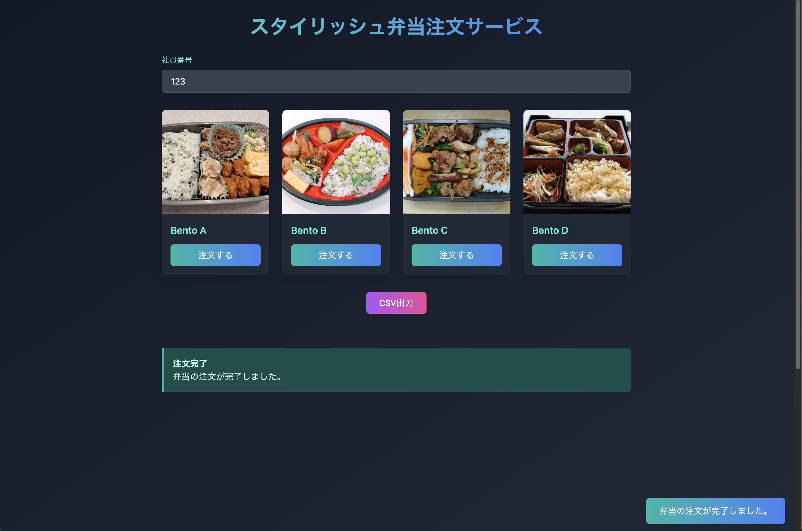
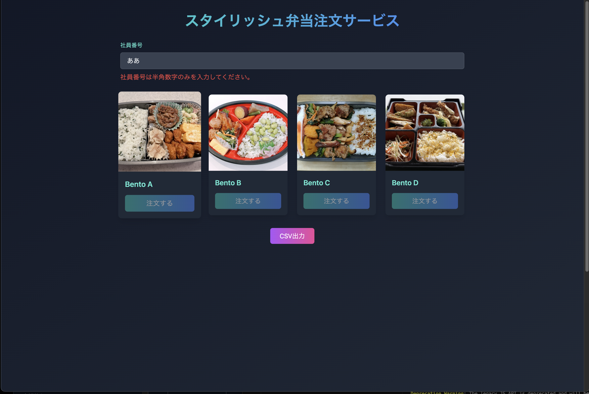
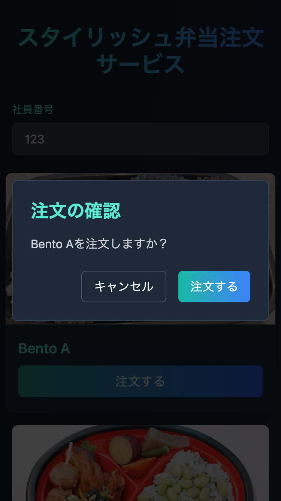

# スタイリッシュ弁当注文アプリ

## プロジェクト概要

スタイリッシュな外観で、弁当を注文できる風の Web アプリです。
このリポジトリを Amplify Gen2 に登録すると、自動ホスティングされ、バックエンドも自動生成されます。
注文すると Order テーブルにレコードが追加され、テーブルの情報を csv で取得することができます。

## 使用方法

1. **依存関係のインストール**:

```sh
npm install
```

2. **環境変数ファイルの設置**:
   .env.local ファイルを受領し、リポジトリのルートディレクトリにに配置してください。

3. **開発サーバーの起動**:

```
npm run dev
```

(4.うまくいかなかった場合、aws 環境との接続についての項目を実施お願いいたします。)

## その他コマンド

lint チェック(もしまとめて確認したい際は実行)

```
npm run lint
```

コードの整形(vsCode の拡張機能で保存時に自動整形されるよう設定してありますが、一括整形したい際に利用してください。)

```
npm run format
```

ビルドコマンド(コミット前に、実行してビルドエラーがないことの確認をお願いします)

```
npm run build
```

バックエンドを更新しながら開発する場合

```
ampx sandbox
```

## 制作時メモ

### デプロイ

PUSH 検知にて Amplify Hosting にて自動ホスティング、デプロイ確認済み

### 環境変数について

現在利用していません。

### aws 環境との接続について

aws 環境の権限は、現時点で付与予定なしのため、環境は共有しません。

共有が必要な場合、権限設定、運用ルールの作成が必要です。
以下手順で、IAM でログインして sandbox 環境へ接続することができます。

1.aws アカウント情報を受け取る

2.対象の AWS 環境と認証設定を行う

```
aws configure
```

3.local から amplify の専用環境に接続するために`amplify_outputs.json`
が root ディレクトリ(package.json と同じ階層)に生成されているか確認。

(公式参考:https://docs.amplify.aws/react/reference/amplify_outputs/ )

4.amplify_outputs.json がない場合、以下コマンドを実行
(サンドボックス環境が作成されます。)

```
ampx sandbox
```

(現時点の Gen2 記事参考:https://zenn.dev/nenenemo/articles/9fa30ef05ffb4d)

#### 個人の AWS 環境ごと作って利用したい場合

1.このリポジトリを自分の GitHub 環境にフォーク(もしくは、zip などで落としてコミット,プッシュ)

2.自分のリポジトリを AWS コンソールの Amplify Gen2 の画面 からリポジトリを読み取り

3.デフォルト設定で公開

### ※TIPS

- CI/CD の変更について
  - amplify.yml ファイルを編集してください

## 構成について

- react , vite ,Amplify Gen2 を利用しています。
- AWS 環境を 1 年以上使用していて無料枠で動かせないため、動作確認後はバックエンドの機能を落として稼働停止します。その際、勿体無いので公開リポジトリとします。

## 制作の背景,作った感想

- 試したい技術つスタックの掛け合わせをいくつか利用するために作成しました。
  - 以下記事を、AmplifyGen2 に置き換えて、内容は合わせましたがコードやデザインなども違うものになっています。
    - 【AI 駆動開発】3 時間で完成！AI 勢揃い+Amplify を使って、弁当注文アプリを爆速開発＆リリース！(前編):https://www.creationline.com/tech-blog/cloudnative/aws/70342
    - (後編は Gen1 とまるで違うため、AI にも頼らずドキュメント頼りで書きました。)
- React
  - Next.js ✖️ Amplify Gen2 の組み合わせはすでに利用していたため今回は Amplify の react template から作成して React を利用
- Amplify Gen2
  - 実務で 0→1 構築にも利用していましたが、個人の環境で動かして料金体系などの感覚レベルを上げるために選定
  - 開発環境を一気に作れる点はありがたいです。
  - 今回初期構築時、間違えてテンプレートを利用せずに画面を作り始めていましたが、バックエンドとの繋ぎ込みなど作り直した方が早そうだったためリポジトリごと作り直しました。
- tailwind
  - 好きではないですが、0→1 フェーズで使うとどうなるか所感を確認するために利用。(セマンティックなクラス命名の css,scss が好きです。)
- v0
  - 触ったことがなかったため、利用してみました。
    - 無料アカウントでプレビューしながら作ることができましたが、割と早い段階で API 利用制限にかかりました。何度も作り直しは必要でしたが、初期構築には良さそうでした。
    - 個人的な感想としては、何度も使うものではないので、GPT にこの機能が追加されるのを待ちます。
- 感想
  - 技術検証用なためサービスとしては使えないアプリですが、Amplify Gen2 で参考になるコードがまだ少ないため、公開リポジトリとして、接続部などどなたかの参考になれば嬉しいです。

### アプリ画面参考(しばらくしたら Amplify の公開をやめるので、雰囲気だけ載せておきます)



